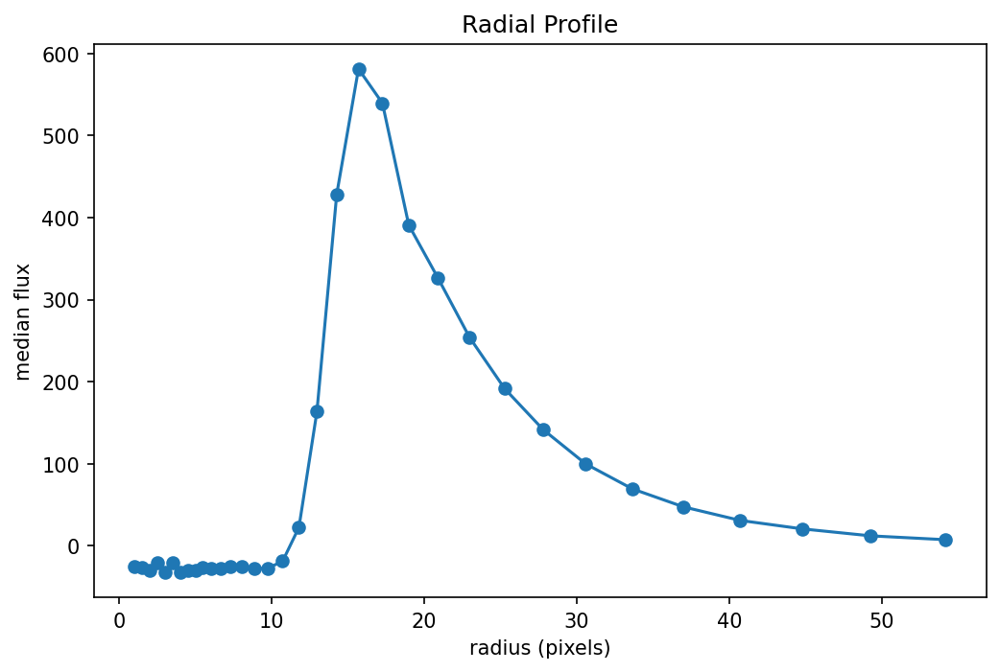
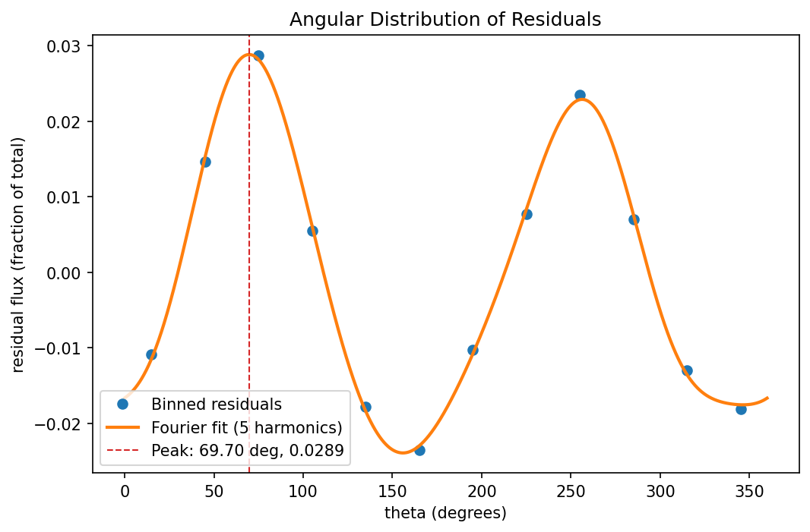
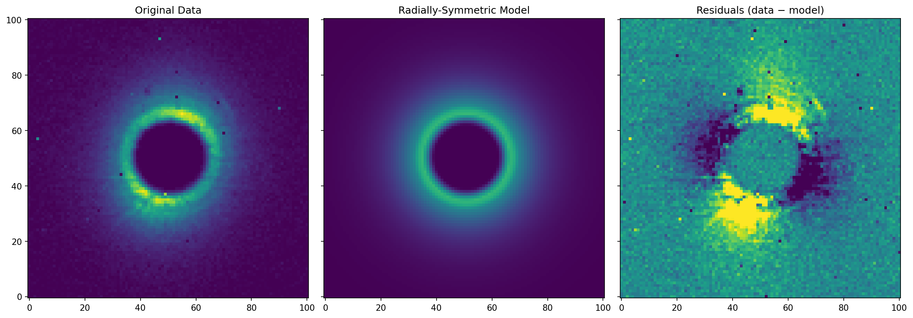

# Guiding RMS Analysis Tool

## Installation on a new machine

> **Complete step-by-step instructions — nothing is assumed beyond having Python 3.10+ available.**

### 1. Clone the repository

```bash
git clone https://github.com/eartigau/nirps_imaging.git
cd nirps_imaging
```

### 2. Create and activate a virtual environment (recommended)

```bash
python3 -m venv .venv
source .venv/bin/activate        # macOS / Linux
# On Windows: .venv\Scripts\activate
```

### 3. Install the Python dependencies

```bash
pip install astropy numpy scipy matplotlib pyyaml
```

### 4. Configure your local data folders

Copy `guiding_config.yaml` and add a block for your OS username:

```yaml
user:
  your_username:            # exact match (replace with: python3 -c "import getpass; print(getpass.getuser())")
    data_folder: '/path/to/your/input/fits/files'
    output_folder: '/path/to/where/you/want/outputs'

  # Wildcard patterns (fnmatch syntax) are also supported — useful for shared configs:
  # 'eartig*':
  #   data_folder: '/Users/eartigau/data/nirps'
  #   output_folder: '/Users/eartigau/data/outputs'
```

Lookup order: **exact username** → **first matching wildcard** → **`default`**.

### 5. Verify the installation

```bash
python get_props_guiding.py --help
```

You should see the full usage message. To run a quick end-to-end test:

```bash
python get_props_guiding.py inputs/NIRPS_2025-07-28T23_07_40_654.fits --output outputs/
```

---

Analyzes on-sky guiding frames stored in the `GUIDING` extension of NIRPS FITS files.
For each exposure it:

1. Removes row/column cross-talk ("hatch") from the raw guiding image.
2. Finds the optimal centre of the star PSF via Nelder-Mead minimization of the
   RMS of the residuals between the data and a circularly-symmetric radial model.
3. Builds a 1-D radial profile and an azimuthal-residual profile, then fits a
   Fourier harmonic model (cos + sin terms) to the angular residuals.
4. Writes a multi-extension FITS (MEF) product with the results.

---

## Requirements

```
python >= 3.10
astropy
numpy
scipy
matplotlib
pyyaml
```

Install everything in one line:

```bash
pip install astropy numpy scipy matplotlib pyyaml
```

---

## Usage

```
python get_props_guiding.py [OPTIONS] file1.fits [file2.fits ...]
```

### Options

| Flag | Default | Description |
|------|---------|-------------|
| `--doplot` | off | Display diagnostic plots interactively while processing |
| `--output DIR` | same folder as input | Write output FITS files to `DIR` instead |
| `--force` | off | Reprocess even if the output `_guiding_analysis.fits` already exists |
| `--documentation` | off | Save all diagnostic plots as PNG files to `figures/` (implies `--force`) |
| `--config FILE` | `guiding_config.yaml` | Use an alternative YAML configuration file |

### Examples

```bash
# Analyse a single file (skips if output already exists)
python get_props_guiding.py NIRPS_2025-07-28T23_07_40_654.fits

# Force reprocessing and show plots
python get_props_guiding.py --force --doplot NIRPS_2025-07-28T23_07_40_654.fits

# Batch process every file in cwd, write results to data/
python get_props_guiding.py --output data/ *.fits

# Regenerate the documentation figures in figures/
python get_props_guiding.py --documentation NIRPS_2025-07-28T23_07_40_654.fits
```

---

## Output FITS structure

Each input file `NAME.fits` produces `NAME_guiding_analysis.fits`:

| Extension | Type | Contents |
|-----------|------|----------|
| `PRIMARY` | Header | Copied from input primary header + analysis keywords below |
| `GUIDING` | Image | Original (raw) guiding frame |
| `RESIDUAL` | Image | Hatch-cleaned residuals (data − radial model) |
| `RADIAL_PROFILE` | Table | Columns `RADIUS` (px) and `FLUX` |
| `ANGULAR_PROFILE` | Table | Columns `ANGLE` (°) and `RESIDUAL_FLUX` (fraction of total) |

### Primary header keywords added

| Keyword | Description |
|---------|-------------|
| `FLUXRING` | Total flux in the radial ring model (ADU) |
| `RMSRESI` | RMS of residuals before flux normalisation |
| `PEAKFLAR` | Peak azimuthal residual from the harmonic fit, as fraction of total flux |
| `ANGLFLAR` | Azimuth angle (°) of the fitted peak |
| `XCEN` | Optimal X centre (pixels) |
| `YCEN` | Optimal Y centre (pixels) |

---

## Configuration (`guiding_config.yaml`)

All hard-coded tuning parameters live in `guiding_config.yaml` next to the script.
Edit that file to change behaviour without touching the code.

```yaml
# Radial profile fit radius (pixels)
rad_rms: 50

# Pixels to trim from the detector edge when building the full radial model
rad_rms_trim: 5

# Radial bin width for r <= rad_bin_inner_max (pixels)
rad_bin_step_inner: 0.5
rad_bin_inner_max: 5

# Fractional bin step for r > rad_bin_inner_max  (next = r * factor)
rad_bin_step_outer_factor: 0.1

# Angular sector size for the residual profile (degrees)
angular_bin_size: 30

# Number of Fourier harmonics used in the angular fit
angular_fit_harmonics: 5

# Angular sampling step (degrees) used to locate the fitted maximum
angular_fit_step_deg: 0.1

# Outlier rejection threshold for robust_mean (× MAD)
robust_mean_sigma: 5

# Pixel brightness threshold for hatch-removal mask (× nanmedian)
hatch_remove_sigma: 3

# WCS pixel scale (degrees); RA axis is negated for standard orientation
wcs_cdelt: 0.1

# WCS frame rotation (degrees)
wcs_rotation_angle: 45.0

# Colour scale of residual image (fraction of peak flux)
plot_residual_scale: 0.1

# User-specific folders (selected from current OS username)
user:
   default:
      data_folder: ''
      output_folder: ''
   # your_username:
   #   data_folder: '/path/to/inputs'
   #   output_folder: '/path/to/outputs'
```

Folder resolution order:
1. CLI argument (`--base` / `--output`)
2. `user.<current_user>` in `guiding_config.yaml`
3. `user.default` in `guiding_config.yaml`
4. Built-in empty default (`''`)

If the current OS user is not listed under `user`, the script prints a warning
and uses `user.default` for folder paths.

If the file is absent, built-in defaults (identical to the values above) are used
and a warning is printed.

---

## Diagnostic figures

Running with `--documentation` saves three PNG files with fixed names in `figures/`.
The names are overwritten on each run, so README links stay stable and do not depend
on the input FITS filename.

### 1. Radial profile — `documentation_radial_profile.png`

Median flux versus radius (pixels) around the optimised PSF centre.
The profile is used to build the circularly-symmetric 2-D model.



---

### 2. Angular residuals — `documentation_angular_residuals.png`

Summed residual flux in each azimuthal sector (bin size set by `angular_bin_size`),
normalised to the total model flux. The solid curve is a Fourier harmonic fit
using both cosine and sine terms up to order 5 by default. This avoids the
forced mirror symmetry of cosine-only models. The reported flare angle and
amplitude come from the maximum of that fitted curve rather than from the
coarse bin centers. A high peak at one angle may indicate a diffraction spike,
a companion, or a tracking artefact.



---

### 3. Data / Model / Residual — `documentation_data_model_residual.png`

Side-by-side view of (left) the background-subtracted guiding frame, (centre) the
radially-symmetric model, and (right) the residuals scaled to ±`plot_residual_scale`
× peak flux.



---

## Algorithm overview

```
Raw FITS  ──►  remove_hatch()          Cross-talk removal (2 passes, row + col)
          ──►  flux-weighted centroid   Initial PSF centre estimate
          ──►  Nelder-Mead optimisation Refine centre by minimising normalised RMS
          ──►  get_profile()            Adaptive-bin 1-D radial profile
          ──►  IUS spline interpolation Circularly-symmetric 2-D model
          ──►  residual analysis        Angular and spatial residuals
          ──►  MEF output               FITS product + optional PNG figures
```

---

## Author

Étienne Artigau — 2026-03-27
